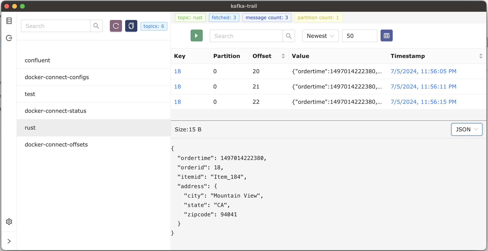

## Introduction:

Welcome to Kafka Trial, a new open-source desktop application designed to simplify Kafka topic exploration. Kafka Trial provides a user-friendly interface for browsing Kafka topics and inspecting data within them. It aims to be an intuitive tool for Kafka users, offering an alternative to existing tools like Offset Explorer.

## Features:

### Topic Exploration:

- Browse Kafka topics effortlessly through a user-friendly interface.
- View metadata and partitions for each topic.
- Inspect messages within topics for data analysis and debugging.

### User-Friendly Interface:

- Intuitive UI designed for ease of use and navigation.
- Responsive layout ensures smooth interaction on desktop environments.
- Dark and light themes available for user preference.

### Cross-Platform Compatibility:

- Built using modern web technologies (Wails, React), ensuring compatibility across Windows, macOS, and Linux platforms.
- Easy installation process for various operating systems.

Getting Started:

To get started with Kafka Trial, follow these steps:

### Installation:

- Download the source code and build package for your operating system.

### Configuration:

- Upon launching Kafka Trial, configure the connection settings to your Kafka cluster.
- Provide the necessary details such as bootstrap servers, security settings, and other authentication parameters.

### Exploring Topics:

- Once connected, navigate through Kafka topics using the sidebar menu.
- Click on individual topics to view metadata and partitions.
- Inspect messages within topics for data analysis and debugging purposes.

Contributing:

Kafka Trial is a new project, and contributions are welcome! If you have ideas for new features, encounter bugs, or want to contribute code enhancements, please submit an issue or pull request on GitHub.
